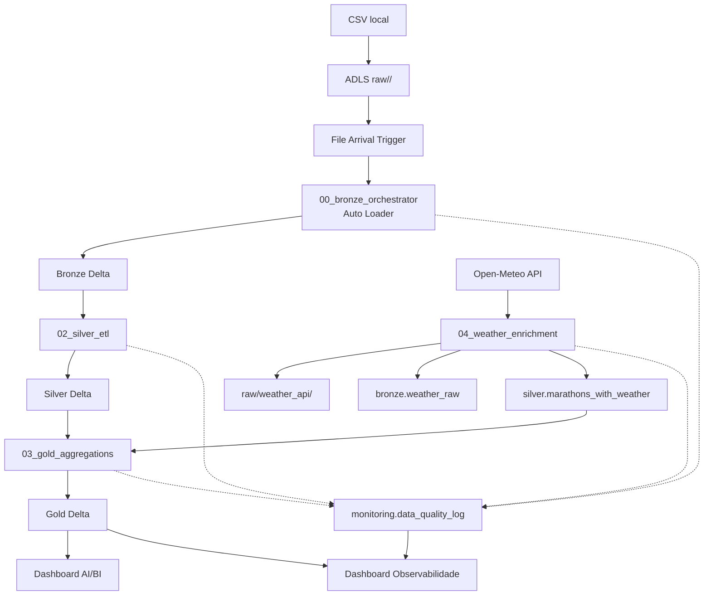

# Case Engenharia de Dados — World Marathon Majors


## I. Objetivo do Case

Desenvolver uma solução completa de Engenharia de Dados para ingerir, processar, armazenar e visualizar dados de resultados de maratonas. A solução demonstra extração, ingestão batch, arquitetura medalhão (Bronze/Silver/Gold), observabilidade, segurança, mascaramento de dados sensíveis, escalabilidade, governança via Unity Catalog e reprodutibilidade.

## I.1 Descritivo em Linguagem de Negócio

Este case simula o projeto de um analista de dados esportivos que precisa responder perguntas comuns de negócio:

- **Participação:** quantos atletas completam cada maratona, por edição e por país.
- **Performance:** qual maratona tem os tempos mais rápidos/lentos e qual país tem melhor desempenho médio.
- **Contexto climático:** como temperatura, precipitação e vento afetam os resultados.
- **Qualidade de dados:** quais etapas da pipeline executam, quantos registros são rejeitados, se há drift de schema.
- **Governança:** quais dados são sensíveis (nomes de atletas) e quem pode vê-los.

A solução implementa um pipeline end-to-end que, na prática, é o equivalente a um **data product** usado por uma empresa de análise esportiva ou por um jornal especializado em corridas.

## II. Arquitetura

### Tecnologias
- **Cloud:** Microsoft Azure
- **Armazenamento:** Azure Data Lake Storage Gen2 com Delta Lake
- **Processamento:** Azure Databricks + PySpark
- **Orquestração:** Databricks Workflows
- **Ingestão:** File Arrival Trigger no Databricks Workflow + Auto Loader `cloudFiles`
- **Governança:** Unity Catalog, External Locations, Managed Identities, **column masks** e **row filters** nativos
- **Observabilidade:** Databricks Job Metrics + tabela `monitoring.data_quality_log` + **dashboard de Observabilidade** separado no AI/BI
- **Segurança:** OIDC, RBAC, criptografia, mascaramento e Access Connector
- **Dashboard:** Databricks AI/BI provisionado por Terraform; Streamlit opcional para consumo externo

### Arquitetura Medalhão
- **Raw:** landing zone para CSV de resultados e JSONs brutos da API Open-Meteo (`raw/weather_api/`). Nenhum dado é processado nesta camada.
- **Bronze:** ingestão dos CSVs via **Databricks Auto Loader** (`cloudFiles`), uma stream por fonte, com checkpoint e schema inferido por subpasta. Carga incremental idempotente via `MERGE` no Delta Lake. Tabelas **externas** no ADLS (`bronze/<source>`). Inclui `bronze.marathon_metadata` e `bronze.weather_raw`.
- **Silver:** limpeza, padronização de schema, integração das fontes, mascaramento/anonimização e validação. Inclui `silver.marathons` (anonimizada), `silver.marathons_pii` (dados pessoais com masks do Unity Catalog) e `silver.marathons_with_weather` (enriquecida com clima). Tabelas **externas** no ADLS.
- **Gold:** agregações e métricas para alimentar o dashboard. Tabelas **externas** no ADLS (`gold/<tabela>`), otimizadas com `OPTIMIZE` + `ZORDER`. Ver seção de tabelas Gold.
- **Monitoring:** tabela `monitoring.data_quality_log` com métricas de qualidade por camada, rastreabilidade end-to-end via `run_id`/`batch_id`, schema drift e tempo de execução.

Todas as camadas são catalogadas no **Unity Catalog** (`marathon.bronze.*`, `marathon.silver.*`, `marathon.gold.*`), mas com os arquivos Delta armazenados em locais controlados pelo ADLS.

### Fluxo de Dados



> **Documentação visual detalhada:** para um diagrama completo com ícones e explicações passo a passo, abra `docs/architecture.html` no navegador ou leia `docs/architecture.md`.

## III. Fontes de Dados

As origens usadas neste case são públicas e disponíveis para download nos links abaixo.

- **Chicago Marathon 2000–2025:** https://www.kaggle.com/datasets/ramostherunning/chicago-marathon-2000-2025
- **London Marathon Results:** https://www.kaggle.com/datasets/kevinegan/london-marathon-results
- **New York City Marathon Results:** https://www.kaggle.com/datasets/runningwithrock/nyc-marathon-results-all-years
- **BMW Berlin Marathon 1999–2025:** https://doi.org/10.5281/zenodo.19342683

Atenção: os nomes dos atletas são campos sensíveis. Na camada Silver eles são removidos e substituídos por um hash, preservando a privacidade e atendendo ao conceito de LGPD no caso.

## IV. Guia de Instalação e Execução

> **Resumo para avaliação (TL;DR):** instale Python, Azure CLI e Terraform → `az login` → baixe os CSVs → `python scripts/setup_all.py` → rode o job no Databricks. A seção 14 (CI/CD) **não** é necessária para o setup local.

### 1. Pré-requisitos

Antes de começar, instale as ferramentas abaixo:

| Ferramenta | Download | Instalação rápida |
|---|---|---|
| **Azure account** | [portal.azure.com](https://portal.azure.com) | Uma conta Azure ativa com crédito ou faturamento habilitado |
| **Python 3.10+** | [python.org/downloads](https://www.python.org/downloads/) | Windows: `winget install Python.Python.3.12` ou baixe o instalador; macOS: `brew install python@3.12`; Linux: `sudo apt install python3.12` |
| **Azure CLI** | [learn.microsoft.com/cli/azure/install-azure-cli](https://learn.microsoft.com/cli/azure/install-azure-cli) | Windows: `winget install Microsoft.AzureCLI`; macOS: `brew install azure-cli`; Linux: `curl -sL https://aka.ms/InstallAzureCLIDeb | sudo bash` |
| **Terraform 64-bit** | [developer.hashicorp.com/terraform/install](https://developer.hashicorp.com/terraform/install) | Windows: `winget install Hashicorp.Terraform`; macOS: `brew install terraform`; Linux: `sudo apt-get install terraform` (use [instruções oficiais](https://developer.hashicorp.com/terraform/install) para adicionar o repo) |
| **Git** | [git-scm.com/downloads](https://git-scm.com/downloads) | Normalmente já instalado no Windows/macOS; Linux: `sudo apt install git` |

**Permissões necessárias:**
- Azure: criar Resource Groups, Storage Accounts e Databricks Workspaces
- Databricks: **Workspace Admin** no workspace que será criado
- Acesso aos datasets listados acima

### 2. Clonar e preparar o ambiente

**Windows (PowerShell):**
```powershell
git clone <URL_DO_REPOSITORIO>
cd marathon-case-data-master
python -m venv venv
.\venv\Scripts\Activate.ps1
pip install -r requirements.txt
```

**macOS/Linux (bash/zsh):**
```bash
git clone <URL_DO_REPOSITORIO>
cd marathon-case-data-master
python3 -m venv venv
source venv/bin/activate
pip install -r requirements.txt
```

### 3. Baixar os datasets

1. Faça o download dos arquivos CSV de cada fonte.
2. Coloque os arquivos na pasta `data/raw/` do repositório.
3. O `upload_raw_data.py` classifica por nome e envia para subpastas no ADLS:
   - `data/raw/Chicago_Marathon_2000-2025.csv` → `raw/chicago/`
   - `data/raw/London_2014_mass_results.csv` → `raw/london/`
   - `data/raw/London_2014_elite_results.csv` → `raw/london/`
   - `data/raw/NYC Marathon Results.csv` → `raw/nyc/`
   - `data/raw/Berlin_Marathon_1999-2025_original.csv` → `raw/berlin/`
   - `data/raw/marathon_metadata.csv` → `raw/metadata/`

> **Nota sobre arquivos grandes:** Berlin (~108 MB), Chicago (~114 MB) e NYC (~91 MB) excedem o limite de 100 MB do GitHub. Por isso não estão no repositório; use os links na seção III ou o seed privado do CI.

### 4. Inspecionar os dados localmente

```bash
# Windows (PowerShell) / macOS / Linux
python scripts/inspect_raw_data.py
```

### 5. Setup unificado (recomendado)

Crie o arquivo `.env` a partir do exemplo:

```bash
# Windows (PowerShell)
copy .env.example .env

# macOS/Linux
cp .env.example .env
```

O `.env` pode manter apenas configurações opcionais:

```env
ALERT_EMAIL=seu-email@exemplo.com                        # opcional
DATABRICKS_WORKSPACE_ROOT=                               # opcional; padrao: /Workspace/Shared/marathon-case
```

> Nenhum token GitHub ou Databricks precisa ser criado. O setup usa a identidade Microsoft Entra ID da sessão `az login` e obtém tokens temporários por `DefaultAzureCredential`.

Execute o setup unico:

```bash
# Windows (PowerShell) / macOS / Linux
python scripts/setup_all.py
```

Esse script orquestra todo o resto usando a sessão Microsoft Entra ID já autenticada no Azure CLI, sem persistir tokens de acesso.

Fluxo do script:

1. Checa prerequisitos (Python, Azure CLI, Terraform)
2. Garante login no Azure
3. Cria a infraestrutura Azure via Terraform (resource group, storage, workspace, access connector)
4. Atualiza `config/config.yaml` com os recursos criados
5. Autentica no Databricks via Microsoft Entra ID e verifica o Unity Catalog
6. Cria storage credential, external location e catalog no Unity Catalog
7. Salva secrets no Databricks
8. Registra EventGrid provider e atribui roles ao Access Connector
9. Sobe os CSVs para `raw/<fonte>/`
10. Implanta os notebooks locais em `/Workspace/Shared/marathon-case/notebooks`
11. Valida individualmente os notebooks implantados
12. Cria o workflow com File Arrival Trigger
13. Cria o SQL Warehouse e publica o Databricks AI/BI Dashboard

O deploy usa a Workspace API com sobrescrita idempotente. O GitHub permanece como controle de versão, mas não é uma dependência do setup nem da execução do workflow. Para uma migração temporária, `DATABRICKS_REPO_PATH` ainda é aceito internamente como caminho legado se `DATABRICKS_WORKSPACE_ROOT` não estiver definido.

O upload para o ADLS usa `DefaultAzureCredential` e o RBAC `Storage Blob Data Contributor` atribuído pelo Terraform à identidade que executa o setup. Para registrar a storage credential no Unity Catalog, a mesma identidade recebe `Contributor` somente sobre o Access Connector. Nenhuma Storage Account Key ou PAT é consultada ou persistida. O uploader aguarda automaticamente a propagação do RBAC em respostas temporárias `401/403`.

Se falhar em qualquer passo, basta corrigir o problema e rodar novamente:

```bash
# Windows (PowerShell) / macOS / Linux
python scripts/setup_all.py
```

O script retoma de onde parou, pois salva o progresso em `.setup_state.json`.

Para recomecar do zero (não apaga a infraestrutura, apenas o estado do setup):

```bash
# Windows (PowerShell) / macOS / Linux
python scripts/setup_all.py --reset
```

> **Atenção MFA:** se o `az login` falhar por exigência de autenticação multifator, use:
>
> ```powershell
> az login --tenant <SEU_TENANT_ID>
> ```

### 6. Executar o Workflow

A primeira execução pode ser iniciada manualmente no Databricks em `Workflows > Jobs`, selecionando `marathon-case-bronze-silver-gold` e clicando em **Run Now**.

Nas próximas vezes, o pipeline dispara sozinho quando novos arquivos chegam na camada `raw`.

> **Importante:** O Databricks provisiona automaticamente um EventGrid System Topic no storage account na primeira execução do trigger. Isso é esperado e indica que o File Arrival está funcionando. O status do trigger deve mudar de `failed` para `no run triggered` (aguardando novos arquivos) após o provisionamento.
>
> Se o trigger continuar falhando por mais de 30 min após os passos acima, pause e despausa o trigger em **Workflows > Jobs > marathon-case-bronze-silver-gold > Triggers** para forçar um retry limpo.

---

### Setup manual (alternativa)

Se preferir executar cada passo separadamente, os scripts individuais continuam disponiveis:

- `infrastructure/terraform/` — deploy completo via Terraform
- `scripts/setup_all.py` — orquestracao unificada
- `scripts/upload_raw_data.py` — upload dos CSVs
- `scripts/create_databricks_workflow.py` — criação do workflow

O workflow executa em sequência:
1. **00_bronze_orchestrator** — para cada subpasta de fonte em `raw/`, inicia um stream do Auto Loader (`cloudFiles`) e aplica MERGE idempotente na Bronze. Gera `run_id`/`batch_id`. Loga métricas em `monitoring.data_quality_log`.
2. **01_bronze_ingestion** — notebook legacy de ingestão batch (não mais invocado pelo workflow; mantido como referência).
3. **02_silver_etl** — gera a tabela `silver.marathons` e loga qualidade (registros inválidos, % nulos, schema drift).
4. **04_weather_enrichment** — enriquece a Silver com dados climáticos do dia da prova (temperatura, precipitação, vento) via API pública Open-Meteo. Salva o JSON bruto da API em `raw/weather_api/` (padrão raw landing), gera `bronze.marathon_metadata`, `bronze.weather_raw` e `silver.marathons_with_weather`. Também loga API failures e cache.
5. **03_gold_aggregations** — gera as tabelas `gold.*` para o dashboard, incluindo `gold.weather_impact`, aplica `OPTIMIZE` + `ZORDER` e loga agregações e schema drift.
6. **05_governance_security** — cria views `silver.marathons_pii_public` e `silver.marathons_pii_admin` sobre a tabela `silver.marathons_pii`. A view pública mascara `athlete_name`/`athlete_id` com `***` e filtra anos ≥ 2014 para não-admins. Em produção com shared cluster, substituir por **column masks** e **row filters** nativos do Unity Catalog.

> O workflow roda em um **single-node job cluster** `Standard_DS3_v2` para o case demonstrativo. O cluster pode ser trocado para autoscaling editando `scripts/create_databricks_workflow.py` quando houver ambientes de worker disponíveis na assinatura.

> **Rastreamento end-to-end:** `run_id` e `batch_id` são gerados no `00_bronze_orchestrator` e propagados via `dbutils.jobs.taskValues` para Silver, Weather e Gold. A tabela `monitoring.data_quality_log` permite rastrear cada execução por camada, incluindo `row_count_in`, `row_count_out`, `rejected_records`, `% nulos`, `schema_drift_flag` e `execution_time_sec`.
>
> **Sobre as datas das provas:** O notebook `04_weather_enrichment` gera `bronze.marathon_metadata` estimando a data de cada prova com base em padrões históricos (ex: último domingo de setembro para Berlim). Se quiser datas exatas, crie um arquivo `data/raw/marathon_metadata.csv` com as colunas `source,year,marathon_name,city,country,latitude,longitude,race_date`; o `upload_raw_data.py` o enviará para `raw/metadata/marathon_metadata.csv`. O notebook faz MERGE/upsert nessa tabela e usa o CSV automaticamente quando ele existe. O exemplo está em `notebooks/marathon_metadata.csv.example`.

### 12. Tabelas Gold — Finalidade

Todas as tabelas Gold ficam em `marathon.gold.*` e são o ponto de consumo do dashboard.

| Tabela | Finalidade |
|---|---|
| `gold.kpi_summary` | KPIs principais por maratona e ano: total de finishers, tempo médio (seg), record da prova e % feminino. Ponto de entrada do dashboard. |
| `gold.finishers_by_year` | Evolução histórica do número de finishers por maratona e ano. |
| `gold.top_countries` | Ranking dos países com mais finishers por maratona, filtrável por fonte e ano. Usado nos gráficos de países no dashboard. |
| `gold.athletes_by_country` | Contagem total de atletas por país e maratona (agregado histórico, sem filtro de ano). |
| `gold.times_distribution` | Estatísticas de distribuição (min, Q1, mediana, média, Q3, max) por maratona, ano, gênero e faixa etária. |
| `gold.marathon_comparison` | Comparativo direto entre as quatro maratonas por ano: finishers e tempo médio de cada uma. |
| `gold.age_gender_profile` | Perfil demográfico: contagem e tempo médio por faixa etária, gênero, fonte e ano. |
| `gold.weather_impact` | Correlação entre temperatura, precipitação, vento e desempenho médio. Disponível somente quando `silver.marathons_with_weather` está populada. |
| `silver.marathons_pii` | Tabela segura com dados pessoais; consumida via views `marathons_pii_public` (mascarada) e `marathons_pii_admin` (full). |

### 12.1 Qualidade e Schema Drift

A observabilidade de dados é registrada em `marathon.monitoring.data_quality_log` — uma tabela append-only com uma linha por notebook/step/run.

**Comportamento com novos CSVs de anos futuros:**

| Cenário | Resposta do pipeline |
|---|---|
| Novo CSV com **mesmo schema** | Ingestão normal; novos registros merged via Delta MERGE idempotente |
| Novo CSV com **colunas renomeadas** | Bronze detecta drift (`schema_drift_flag = True`), status `WARN`, continua. Silver mapeia o que conseguir; colunas ausentes ficam `null` |
| Novo CSV com **colunas extras** | Carregado normalmente na Bronze; Silver ignora colunas não mapeadas |
| Novo CSV com **colunas obrigatórias faltando** (ex: `finish_time`) | Pipeline continua, mas registros sem tempo de conclusão são rejeitados na Silver (`rejected_records` > 0); tabelas Gold refletem apenas dados válidos |

O pipeline **nunca falha por schema drift** — registra WARN no log e continua. Para checar:

```sql
SELECT layer, step, schema_drift_flag, status, details, recorded_at
FROM marathon.monitoring.data_quality_log
WHERE schema_drift_flag = TRUE
ORDER BY recorded_at DESC
```

### 13. Dashboards

#### 13.1 Databricks AI/BI Dashboard

O dashboard oficial do case é versionado em `dashboard/databricks/marathon_dashboard.lvdash.json` e provisionado automaticamente pelo último passo de `scripts/setup_all.py`.

O Terraform em `infrastructure/terraform/databricks/` cria:

- SQL Warehouse Serverless `2X-Small`, Photon habilitado, cluster único e **auto-stop de 1 minuto** para reduzir custos;
- **Dashboard principal** publicado em `/Shared/marathon-case`;
- **Dashboard de observabilidade** publicado em `/Shared/marathon-case` (fonte `monitoring.data_quality_log`);
- pipeline CI desliga o SQL Warehouse após a execução;
- outputs dos warehouses, HTTP Path e IDs dos dashboards.

Após o Terraform, o `setup_all.py` repatcheia ambos os dashboards via API injetando os prefixos `{catalog}.gold.` e `{catalog}.monitoring.` explicitamente em todas as queries de dataset. Isso garante que os dashboards funcionem corretamente independentemente do catálogo padrão do workspace. Para CI usa `marathon_prod.gold.*`/`marathon_prod.monitoring.*`; para local usa `marathon.gold.*`/`marathon.monitoring.*`.

O setup usa `no_wait=true`: não bloqueia esperando o compute iniciar e imprime a URL publicada ao final. Na primeira consulta, o warehouse pode permanecer em `STARTING` enquanto a Azure provisiona o cluster.

**Páginas do dashboard principal:**

| Página | Conteúdo |
|---|---|
| Visão Geral | KPIs globais: total de finishers, edições, maratonas e tempo médio (min) |
| Evolução de concluintes | Finishers por ano e por maratona com filtros de fonte e ano |
| Top 20 países | Ranking de participação por país, filtráveis por maratona e ano |
| Países — performance | Tempo médio por país, filtrável por maratona e ano |
| Distribuição de tempos | Box-plot com quartis, mediana e média por grupo demográfico |
| Demografia | Perfil por faixa etária e gênero (F, M, X) |
| Comparação entre maratonas | Evolução histórica comparativa das quatro majors |
| Clima e performance | Correlação temperatura/precipitação × tempo médio por edição |
| Observabilidade | KPIs de qualidade: execuções, schema drift, rejeitados, tempo por etapa |

As sete tabelas de `marathon.gold` consumidas pelo dashboard principal são: `kpi_summary`, `finishers_by_year`, `top_countries`, `age_gender_profile`, `weather_impact`, `times_distribution` e `marathon_comparison`.

> **Screenshots:** captures de cada página/view dos dashboards devem ficar em `docs/screenshots/` (ver `docs/screenshots/README.md` para nomes sugeridos).

> **Re-deploy manual dos dashboards:** se precisar reaplicar a definição JSON sem rodar o setup completo:
> ```bash
> # Windows (PowerShell)
> $env:DATABRICKS_TOKEN = (az account get-access-token --resource "2ff814a6-3304-4ab8-85cb-cd0e6f879c1d" --query accessToken -o tsv)
> python scripts/_update_dashboard_api.py --catalog marathon
>
> # macOS/Linux
> export DATABRICKS_TOKEN=$(az account get-access-token --resource "2ff814a6-3304-4ab8-85cb-cd0e6f879c1d" --query accessToken -o tsv)
> python scripts/_update_dashboard_api.py --catalog marathon
> ```

#### 13.2 Streamlit opcional

O consumidor externo em `dashboard/app.py` continua disponível. O setup preenche `DATABRICKS_HTTP_PATH` automaticamente com o warehouse provisionado.

```bash
# Windows (PowerShell)
python -m venv .venv
.venv\Scripts\Activate.ps1
pip install -r requirements.txt
streamlit run dashboard/app.py

# macOS/Linux
python3 -m venv .venv
source .venv/bin/activate
pip install -r requirements.txt
streamlit run dashboard/app.py
```

### 14. CI/CD federado com GitHub Actions

> ⚠️ **Esta seção é opcional e só é necessária para CI/CD (deploy via GitHub Actions).**
>
> **Para o setup local (avaliação do case), pule esta seção.** O `setup_all.py` provisiona todo o ambiente local (`rg-marathon-case`, workspace, Unity Catalog, notebooks, workflow e dashboards) sem nenhum bootstrap.
>
> O bootstrap descrito abaixo serve apenas para quem quer reproduzir a esteira de deploy automatizado: ele cria a identidade OIDC do GitHub, o backend remoto dos states Terraform e o Storage Seed privado com os CSVs — recursos persistentes que ficam em `rg-marathon-bootstrap` e não são destruídos junto com o ambiente descartável.

A esteira usa GitHub OIDC e uma User Assigned Managed Identity. Não existem client secrets, PATs ou chaves de Storage no GitHub. Pull requests e pushes na `main` executam somente validações locais; tags `v*` acionam o provisionamento completo no environment protegido `production`. Para isolar ownership no metastore compartilhado, o setup local usa o catálogo `marathon` e a esteira usa `marathon_prod`, sem alterar o nome visual do dashboard.

#### 14.1 Bootstrap único

O bootstrap cria recursos persistentes que não fazem parte do ambiente descartável:

- Resource Group `rg-marathon-bootstrap`;
- identidade `id-marathon-github` e credencial federada para o environment `production`, vinculada aos IDs imutáveis do proprietário e do repositório;
- backend privado para os states Terraform;
- Storage Seed privado para os CSVs brutos;
- Resource Group vazio `rg-marathon-prod`, onde a identidade recebe `Contributor` e `User Access Administrator`; `rg-marathon-case` permanece exclusivo do setup local.

Execute o bootstrap apenas com o ambiente descartável removido, pois ele passa a ser o proprietário do Resource Group alvo:

```bash
# Windows (PowerShell) / macOS / Linux
az login
python scripts/bootstrap_ci.py
```

O script aplica `infrastructure/terraform/bootstrap`, envia os CSVs locais para o Seed usando Entra ID e imprime as GitHub Actions Variables necessárias. O state do bootstrap permanece local e deve ser preservado em armazenamento administrativo seguro; ele não contém credenciais.

#### 14.2 Configuração do GitHub

Crie o environment `production`, restrinja-o a tags `v*` e, para uma implantação controlada, configure required reviewers. Cadastre nele como **Variables**, não Secrets, os valores impressos pelo bootstrap:

- `AZURE_CLIENT_ID`
- `AZURE_TENANT_ID`
- `AZURE_SUBSCRIPTION_ID`
- `TF_BACKEND_RESOURCE_GROUP`
- `TF_BACKEND_STORAGE_ACCOUNT`
- `TF_BACKEND_CONTAINER`
- `SEED_STORAGE_ACCOUNT`
- `SEED_CONTAINER`

O workflow possui somente `contents: read` e `id-token: write`; as ações externas estão fixadas por commit SHA. O deploy não contém comandos `destroy` e usa concurrency lock para impedir duas implantações simultâneas.

#### 14.3 Criar uma release

```bash
# Windows (PowerShell) / macOS / Linux
git tag v1.0.0
git push origin v1.0.0
```

O workflow `.github/workflows/release-deploy.yml` autentica por OIDC, baixa o Seed privado, aplica os states remotos de Azure e Databricks, executa o setup sem interação e aguarda o workflow Bronze/Silver/Gold finalizar. O workflow `.github/workflows/validate.yml` não recebe identidade Azure.

### 15. Destruir o ambiente

Para evitar custos após a avaliação, destrua todos os recursos provisionados.

**Ambiente local (`rg-marathon-case`):**
```bash
# Windows (PowerShell) / macOS / Linux
python scripts/destroy_all.py --environment local
```

**Ambiente de produção/CI (`rg-marathon-prod`):**
- Dispare o workflow manual `.github/workflows/destroy-production.yml` no GitHub Actions, ou
- Execute `python scripts/destroy_all.py --environment production`

> O bootstrap (`rg-marathon-bootstrap`, identidade OIDC e backend Terraform) é preservado para permitir futuras implantações. Se quiser removê-lo também, execute `terraform destroy` em `infrastructure/terraform/bootstrap`.

## V. Estrutura do Repositório

```text
marathon-case-data-master/
├── README.md
├── .gitignore
├── .env.example            # template de variaveis de ambiente
├── requirements.txt
├── config/
│   └── config.yaml
├── data/
│   └── raw/                # CSVs brutos (não versionados — arquivos >100 MB)
├── docs/
│   ├── architecture.md
│   ├── architecture.html   # versão visual
│   └── screenshots/        # captures das páginas dos dashboards
├── infrastructure/
│   └── terraform/           # provisionamento end-to-end
│       ├── main.tf
│       ├── metastore.tf
│       ├── providers.tf
│       ├── variables.tf
│       ├── outputs.tf
│       ├── terraform.tfvars.example
│       ├── databricks/       # SQL Warehouse e AI/BI Dashboards
│       ├── bootstrap/        # identidade OIDC, backend e Storage Seed
│       └── ci/               # roots Terraform com backend remoto
├── dashboard/
│   └── databricks/
│       ├── marathon_dashboard.lvdash.json
│       └── observability_dashboard.lvdash.json
├── notebooks/
│   ├── 00_bronze_orchestrator.py
│   ├── 01_bronze_ingestion.py
│   ├── 02_silver_etl.py
│   ├── 03_gold_aggregations.py
│   ├── 04_weather_enrichment.py
│   └── marathon_metadata.csv.example
├── .github/workflows/            # validação e deploy por tag com OIDC
├── scripts/
│   ├── bootstrap_ci.py           # bootstrap único da esteira
│   ├── run_databricks_workflow.py
│   ├── setup_all.py              # setup unificado (recomendado)
│   ├── setup_unity_catalog.py    # cria/escolhe metastore e configura UC
│   ├── setup_databricks_secrets.py
│   ├── upload_raw_data.py
│   ├── create_databricks_workflow.py
│   ├── enable_file_events.py     # versao Python
│   ├── enable_file_events.ps1    # versao PowerShell
│   └── inspect_raw_data.py
├── src/
│   ├── utils.py
│   └── data_quality.py
```

## VI. Melhorias e Considerações Finais

- Implementar testes de qualidade automatizados na Silver (Great Expectations / Delta Live Tables expectations).
- Expandir o dashboard de observabilidade com métricas de custo por run e alertas operacionais.
- Otimizar o particionamento das tabelas Gold conforme os padrões de acesso do dashboard.
- Expandir as fontes para Boston, Tóquio e outras majors, aproveitando a arquitetura extensível.
- Buscar datas exatas das provas via API de calendário/esportes para substituir a estimativa heurística usada no `04_weather_enrichment`.
- `monitoring.data_quality_log` já funciona em modo append; adicionar particionamento por `batch_id` para histórico de longo prazo.

## VII. Changelog

### [2025] — Setup unificado e simplificacao

- **Setup unificado:** novo `scripts/setup_all.py` executa todo o provisionamento e configuracao em um unico comando, com persistencia de estado para retomada.
- **Infraestrutura como Terraform:** pasta `infrastructure/terraform/` cria Azure resources e Databricks workspace de forma automatizada.
- **Configuracao do Unity Catalog via script:** `scripts/setup_unity_catalog.py` cria/escolhe metastore, atribui o workspace e cria storage credential, external location e catalog.
- **Autenticação sem PAT:** APIs e SQL Connector usam tokens temporários Microsoft Entra ID obtidos por `DefaultAzureCredential`; nenhum PAT é solicitado ou persistido.
- **Arquivo `.env`:** centraliza somente configurações não secretas, como host, email de alerta, HTTP Path e caminho opcional no workspace.
- **Versao Python do enable_file_events:** nao depende mais exclusivamente do PowerShell.
- **Bicep removido:** todo o provisionamento usa Terraform (pastas `infrastructure/terraform/`); arquivos Bicep foram descontinuados.

### [2025] — Correções e melhorias no dashboard AI/BI

- **Normalização de source no dashboard:** valores de origem padronizados para Title Case nos datasets (`berlin` → `Berlin`, `nyc` → `New York`) via `CASE` nas queries, eliminando duplicatas nos filtros.
- **KPI tempo médio corrigido:** counter widget alterado de expressão `CONCAT` (string `HH:MM`) para `CAST(ROUND(AVG(avg_finish_time_min), 0) AS INT)`. Widgets contador do Databricks AI/BI não renderizam strings; o formato `format.precision` foi removido por ser inválido nesse tipo de widget.
- **Países filtráveis:** dataset `country_performance` migrado de `athletes_by_country` (sem `source`/`year`) para `top_countries` (com `source`/`year`), permitindo que os filtros globais de maratona e ano atuem nos gráficos de países.
- **Prefixo de catálogo explícito nas queries:** o `PATCH /api/2.0/lakeview/dashboards/{id}` não preserva o `dataset_catalog` do Terraform. O `setup_all.py` agora repatcheia o dashboard após o Terraform injetando `{catalog}.gold.{tabela}` em todas as queries de dataset. Script `scripts/_update_dashboard_api.py` disponível para re-deploys pontuais.
- **Remoção do widget de qualidade:** tabela "Últimas verificações de qualidade" removida do dashboard (monitoramento continua ativo em `marathon.monitoring.data_quality_log`).
- **Filtro de gênero sanitizado:** queries de demographics e times_metrics filtram apenas valores válidos (`F`, `M`, `X`, `NON-BINARY`, `NOT SPECIFIED`), excluindo ruído de dados brutos.

### [2025] — Ajustes de execução e correções de pipeline

- **Observabilidade append-only:** tabela `monitoring.data_quality_log` migrada de `overwrite` para `append` com `mergeSchema=true`, eliminando conflito de schema entre notebooks executados na mesma run.
- **Ignorar arquivos não-fonte no orquestrador:** `00_bronze_orchestrator.py` agora ignora arquivos como `marathon_metadata.csv` que não são fontes de resultados de maratona, em vez de abortar com `ValueError`.
- **Correção de conflito de nomes PySpark/Python no Gold:** no `03_gold_aggregations.py`, as funções `round`, `sum`, `min` e `max` importadas do PySpark foram renomeadas para `spark_round`, `spark_sum`, `spark_min` e `spark_max`, preservando os built-ins do Python para uso em listas e arredondamento escalares.
- **Upload sem chaves:** o script `upload_raw_data.py` usa Microsoft Entra ID, `DefaultAzureCredential` e RBAC com retry de propagação; nenhuma Storage Account Key é consultada ou persistida.