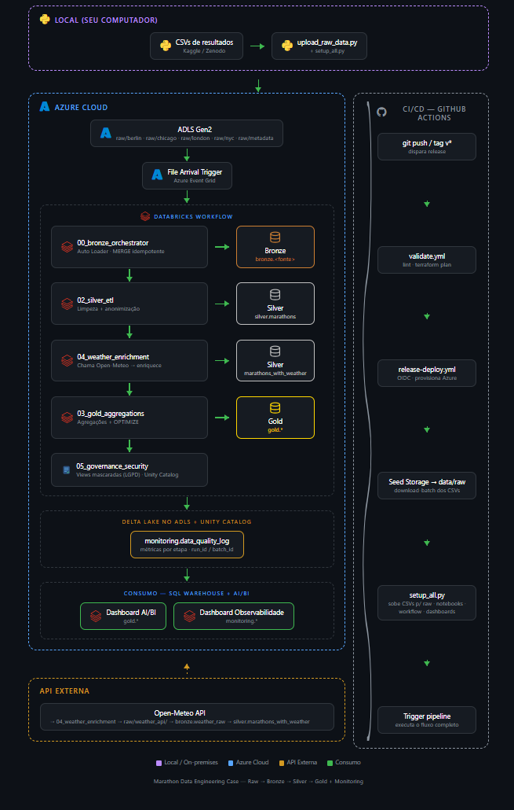
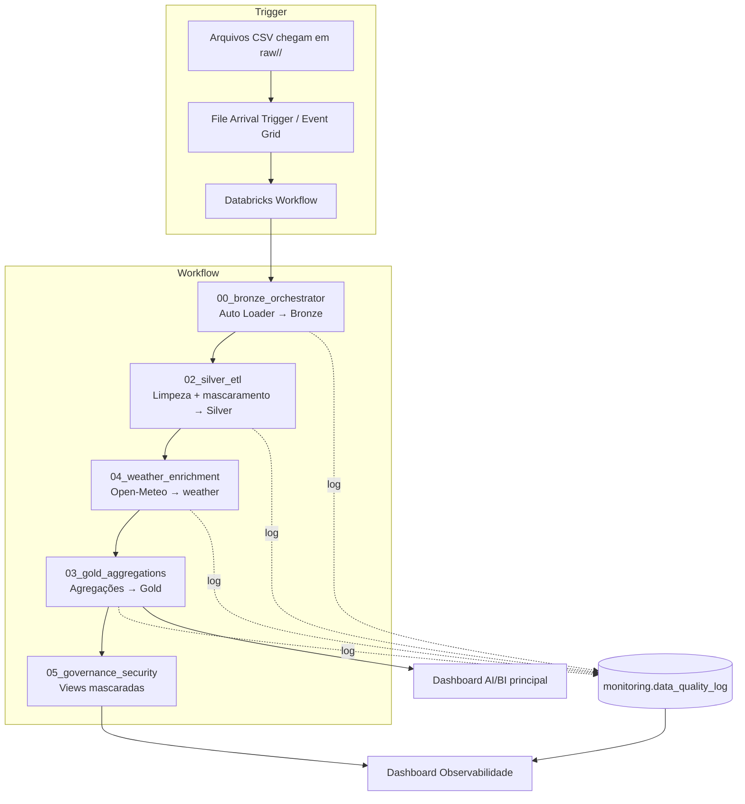

# Arquitetura do Case

## Visão Geral

Solução de Engenharia de Dados na Azure para processar e visualizar dados das maratonas de Chicago, Londres, Nova York e Berlim. A arquitetura usa ADLS Gen2 como data lake, Databricks com PySpark/Delta Lake e Unity Catalog para governança.

> Versão interativa com ícones: abra `docs/fluxo.html` no navegador.

## Camadas

### Raw
- Landing zone para os arquivos CSV brutos e para os JSONs brutos da API Open-Meteo.
- Armazenada em `abfss://marathon-data@<storage>.dfs.core.windows.net/raw/`.
- Cada fonte possui sua própria subpasta para separação de schemas:
  - `raw/berlin/`
  - `raw/chicago/`
  - `raw/london/`
  - `raw/nyc/`
  - `raw/metadata/` (CSV de metadados das provas, consumido pelo weather)
- Os arquivos `raw/weather_api/{source}/{year}/{race_date}.json` representam o landing de dados externos via API, mantendo o mesmo padrão raw → bronze.
- A ingestão CSV é acionada por **File Arrival Trigger** sempre que novos arquivos chegam em qualquer subpasta.

### Bronze
- Recebe os arquivos CSV brutos de cada origem via **Databricks Auto Loader** (`cloudFiles`).
- Cada fonte tem seu próprio schema inferido, checkpoint e localização de schema (`bronze/_checkpoints/<source>`, `bronze/_schemas/<source>`).
- Mantém os dados com o mínimo de transformação.
- Aplica registro de arquivos processados (`bronze.file_metadata`).
- Carga incremental idempotente: Auto Loader processa só arquivos novos; dentro de cada micro-batch aplica `MERGE` no Delta Lake por `source + year + row_hash`.
- Tabelas **externas** armazenadas em `abfss://.../bronze/<source>`.

### Silver
- Limpa e padroniza os dados de cada fonte.
- Unifica os esquemas diferentes das quatro maratonas.
- Aplica mascaramento e anonimização de atletas.
- Garante qualidade com regras de validação.
- Tabela **externa** anonimizada `silver.marathons` armazenada em `abfss://.../silver/marathons`.
- Tabela **externa** PII `silver.marathons_pii` contém `athlete_name`/`athlete_id`. Como o job cluster é single-user, são criadas views `silver.marathons_pii_public` (mascarada) e `silver.marathons_pii_admin` (full). Em shared clusters, substituir por **column masks** e **row filters** nativos do Unity Catalog.
- Tabela `bronze.marathon_metadata` — data, cidade, país, latitude e longitude de cada prova (gerada via heurística ou carregada de CSV).
- Tabela `bronze.weather_raw` — cache dos dados de clima parseados a partir dos JSONs brutos em `raw/weather_api/`.
- Tabela `silver.marathons_with_weather` enriquece os resultados com condições climáticas do dia da prova (temperatura, precipitação, vento).
- `OPTIMIZE` + `ZORDER` aplicados nas tabelas Silver para compactação e leitura eficiente.

### Gold

Gera agregações e métricas para o dashboard. Tabelas **externas** armazenadas em `abfss://.../gold/<tabela>`.

| Tabela | Finalidade |
|---|---|
| `gold.kpi_summary` | KPIs principais por maratona e ano: total de finishers, tempo médio, record da prova e % feminino. Ponto de entrada do dashboard. |
| `gold.finishers_by_year` | Evolução histórica do número de finishers por maratona ao longo dos anos. |
| `gold.top_countries` | Ranking dos países com mais finishers por maratona e ano — usado nos gráficos de países do dashboard (filtráveis por fonte e ano). |
| `gold.athletes_by_country` | Contagem total de atletas por país e maratona (agregado histórico, sem partição por ano). |
| `gold.times_distribution` | Distribuição dos tempos de chegada em faixas (ex: < 3h, 3–4h, 4–5h, > 5h) por maratona e ano. |
| `gold.marathon_comparison` | Comparativo direto entre as quatro maratonas: tempo médio, record, total e % feminino. |
| `gold.age_gender_profile` | Perfil demográfico dos finishers: contagem e tempo médio por grupo etário e gênero. |
| `gold.weather_impact` | Correlação entre condições climáticas e desempenho médio. Criada somente quando `silver.marathons_with_weather` estiver disponível. |
| `silver.marathons_pii` | Tabela segura com dados pessoais; consumida via views `marathons_pii_public` (mascarada) e `marathons_pii_admin` (full). |

### Monitoring

- `monitoring.data_quality_log`: tabela em modo **append** com uma linha por step/notebook/run. Campos: `run_id`, `batch_id`, `layer`, `step`, `source`, `year`, `row_count_in`, `row_count_out`, `rejected_records`, `key_columns_null_pct_json`, `schema_drift_flag`, `execution_time_sec`, `status`, `details`, `recorded_at`.

### Estrutura por Camada

| Camada | Tabela/View | Tipo | Chave/Partição | Conteúdo |
|---|---|---|---|---|
| Raw | `raw/<fonte>/` | Arquivo | — | CSVs brutos por maratona |
| Raw | `raw/weather_api/` | Arquivo | `{source}/{year}/{race_date}.json` | JSONs brutos da API Open-Meteo |
| Bronze | `bronze.<source>` | Delta externa | `source + year + row_hash` | Resultados brutos com metadados de ingestão |
| Bronze | `bronze.marathon_metadata` | Delta externa | `source + year` | Metadados das provas (data, cidade, coords) |
| Bronze | `bronze.weather_raw` | Delta externa | `source + year` | Clima parseado dos JSONs |
| Bronze | `bronze.file_metadata` | Delta externa | `file_name` | Auditoria de arquivos processados |
| Silver | `silver.marathons` | Delta externa | `source + year` | Dados limpos, anonimizados, sem PII |
| Silver | `silver.marathons_pii` | Delta externa | `source + year` | PII completa (nomes, IDs) |
| Silver | `silver.marathons_pii_public` | View | — | `athlete_name`/`athlete_id` mascarados; filtro `year >= 2014` para não-admins |
| Silver | `silver.marathons_pii_admin` | View | — | Acesso completo para grupo `admins` |
| Silver | `silver.marathons_with_weather` | Delta externa | `source + year` | Resultados + clima do dia da prova |
| Gold | `gold.kpi_summary` | Delta externa | `source + year` | KPIs principais por edição |
| Gold | `gold.finishers_by_year` | Delta externa | `source + year` | Evolução de finishers |
| Gold | `gold.top_countries` | Delta externa | `source + year` | Ranking de países por participação |
| Gold | `gold.athletes_by_country` | Delta externa | — | Agregado histórico por país |
| Gold | `gold.times_distribution` | Delta externa | `source + year` | Distribuição de tempos em faixas |
| Gold | `gold.marathon_comparison` | Delta externa | `source + year` | Comparativo entre maratonas |
| Gold | `gold.age_gender_profile` | Delta externa | `source + year` | Perfil demográfico |
| Gold | `gold.weather_impact` | Delta externa | `source + year` | Correlação clima × performance |
| Monitoring | `monitoring.data_quality_log` | Delta externa | `run_id, batch_id, step` | Métricas de qualidade por etapa |

## Fluxo de Execução

1. Arquivos CSV são enviados para `raw/<fonte>/` via `scripts/upload_raw_data.py` (classifica por nome e cria o container se não existir).

1. Arquivos CSV são enviados para `raw/<fonte>/` via `scripts/upload_raw_data.py` (classifica por nome e cria o container se não existir).
2. O **File Arrival Trigger** detecta a chegada em qualquer subpasta de `raw/` e dispara o Databricks Workflow.
3. `00_bronze_orchestrator`:
   - Gera `run_id` (UUID) e `batch_id` (timestamp), propagados via `dbutils.jobs.taskValues`.
   - Para cada subpasta de fonte encontrada (`berlin/`, `chicago/`, `london/`, `nyc/`), inicia um stream do Auto Loader (`readStream.format("cloudFiles")`).
   - Em cada micro-batch, sanitiza colunas, extrai ano, adiciona `row_hash` e aplica `MERGE` idempotente na tabela Bronze.
   - Registra métricas em `monitoring.data_quality_log` (modo append).
5. `02_silver_etl` lê as tabelas Bronze, normaliza schemas, aplica mascaramento e grava `silver.marathons`. Registra métricas.
6. `04_weather_enrichment`:
   - Lê `raw/metadata/marathon_metadata.csv` (se existir) para datas exatas; caso contrário usa heurística.
   - Grava/atualiza `bronze.marathon_metadata` via `MERGE`.
   - Para cada `(source, year)` sem registro, chama Open-Meteo, persiste JSON bruto em `raw/weather_api/`, parseia e grava em `bronze.weather_raw` via `MERGE`.
   - Cria `silver.marathons_with_weather` com join por `source + year`.
   - Registra métricas em `monitoring.data_quality_log`.
7. `03_gold_aggregations` gera todas as tabelas Gold, aplica `OPTIMIZE` + `ZORDER` e registra métricas. Usa `silver.marathons_with_weather` quando disponível; cai para `silver.marathons` caso contrário.
8. `05_governance_security` cria views mascaradas (`marathons_pii_public`) e administrativa (`marathons_pii_admin`) sobre `silver.marathons_pii`.
9. O dashboard principal consome as tabelas Gold; o **dashboard de Observabilidade** separado consome `monitoring.data_quality_log`.

## Governança e Segurança

- Todas as tabelas são registradas no **Unity Catalog** (`marathon.bronze.*`, `marathon.silver.*`, `marathon.gold.*`, `marathon.monitoring.*`).
- Dados sensíveis (nomes e identificadores de atletas) anonimizados na `silver.marathons` via hash SHA-256.
- A tabela `silver.marathons_pii` mantém os campos pessoais originais. No cluster single-user do case, são criadas views `marathons_pii_public` (mascarada) e `marathons_pii_admin` (full). Em produção com shared cluster, a boa prática é usar **column masks** e **row filters** nativos do Unity Catalog.
- Acesso ao ADLS via **Azure Access Connector** e managed identity.
- Criptografia em trânsito e em repouso do ADLS Gen2.
- Controle de acesso via RBAC do Azure e permissões do Unity Catalog.
- **Lineage automático:** o Unity Catalog captura automaticamente o lineage de leitura/escrita entre tabelas e notebooks executados no Databricks. Para visualizar, acesse **Catalog > Tables** e clique em **Lineage** nas tabelas `silver.marathons`, `silver.marathons_with_weather` ou `gold.*`.

## Escalabilidade e Observabilidade

- ADLS Gen2 para armazenamento distribuído.
- **Job cluster single-node** `Standard_DS3_v2` para o case demonstrativo (autoscaling disponível alterando `scripts/create_databricks_workflow.py`).
- **Delta Lake** com partições por `source` e `year` e `OPTIMIZE` + `ZORDER` para leitura eficiente.
- Ingestão event-driven: cluster só liga quando arquivos chegam.
- SQL Warehouse com **auto-stop de 1 minuto**; pipeline CI desliga o warehouse após execução para reduzir custos.
- Ingestão de London otimizada com leitura em lote ao invés de uma chamada por arquivo.
- **Observabilidade:** tabela `marathon.monitoring.data_quality_log` (append-only, `mergeSchema=true`) registra por step/notebook:
  - `row_count_in` / `row_count_out`
  - `% nulos` em colunas-chave (`key_columns_null_pct_json`)
  - `rejected_records` (inclui arquivos ignorados no orquestrador)
  - `schema_drift_flag` — `True` quando colunas do CSV diferem do schema anterior (Bronze) ou do schema esperado (Silver)
  - `execution_time_sec` — identifica gargalos por etapa
  - **O pipeline nunca falha por schema drift** — registra `WARN` e continua. Dados com colunas obrigatórias ausentes são marcados como `rejected_records`.
- **Rastreabilidade end-to-end:** `run_id` (UUID) e `batch_id` (timestamp) gerados no `00_bronze_orchestrator` e propagados via `dbutils.jobs.taskValues` para todos os notebooks downstream.
- **Dashboard de Observabilidade:** dashboard AI/BI separado com KPIs de execução, schema drift, registros rejeitados e tempo por etapa (fonte `monitoring.data_quality_log`).
- **Alertas:** notificações por email configuradas no Databricks Workflow para falhas (`ALERT_EMAIL`).
- **Lineage:** o Unity Catalog captura automaticamente lineage de leitura/escrita. Visualize em **Catalog > Tables > Lineage** nas tabelas Silver e Gold.

## Decisões de Implementação

| Problema | Decisão |
|---|---|
| Schema conflict no `monitoring.data_quality_log` | Modo `overwrite` causava `DELTA_SCHEMA_CHANGE_SINCE_ANALYSIS`; migrado para `append` com `mergeSchema=true` |
| `marathon_metadata.csv` em `raw/` abortava o orquestrador | Arquivos não reconhecidos agora são ignorados com log, sem falha |
| Conflito `round`/`sum`/`min`/`max` PySpark vs Python em Gold | Funções PySpark renomeadas para `spark_round`, `spark_sum`, `spark_min`, `spark_max`; built-ins Python preservados |
| Container ADLS ausente após limpeza de storage | `upload_raw_data.py` cria o container automaticamente se não existir |
| `PATCH /api/2.0/lakeview/dashboards/{id}` apaga `dataset_catalog` do Terraform | `setup_all.py` repatcheia o dashboard após o Terraform injetando `{catalog}.gold.{tabela}` explicitamente em todas as queries via regex. Garante que o dashboard funcione em qualquer catálogo (`marathon` local, `marathon_prod` CI) sem depender do contexto do workspace |
| Filtros do dashboard com valores duplicados (`berlin` e `Berlin`) | Source normalizado para Title Case via `CASE WHEN` em todos os datasets; `marathon_comparison` já emitia valores capitalizados — os filtros agora mostram apenas `Berlin`, `Chicago`, `London`, `New York` |
| KPI "Tempo médio" exibia "No data" | Counter widget do Databricks AI/BI não aceita string (`CONCAT HH:MM`) nem `format.precision`. Substituído por `CAST(ROUND(AVG(avg_finish_time_min), 0) AS INT)` sem spec de format |
| Gráficos de países não respondiam a filtros | Dataset `country_performance` usava `athletes_by_country` (sem colunas `source`/`year`). Migrado para `top_countries` (com `source`/`year`), adicionado ao filtro global |
| Terraform 32-bit (`windows_386`) — provider Databricks incompatível | `find_databricks_terraform()` no `setup_all.py` detecta e rejeita binários `windows_386`; exige Terraform AMD64. Script `_update_dashboard_api.py` disponível para re-deploy do dashboard sem Terraform |
